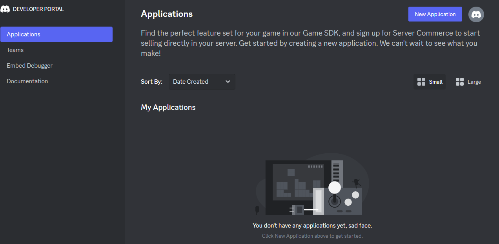
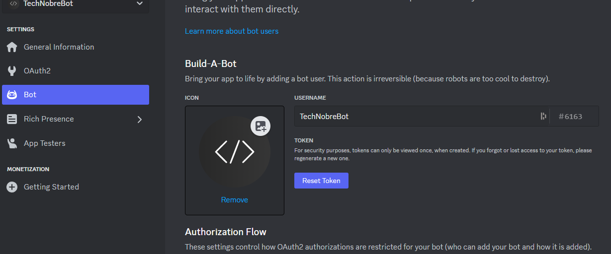
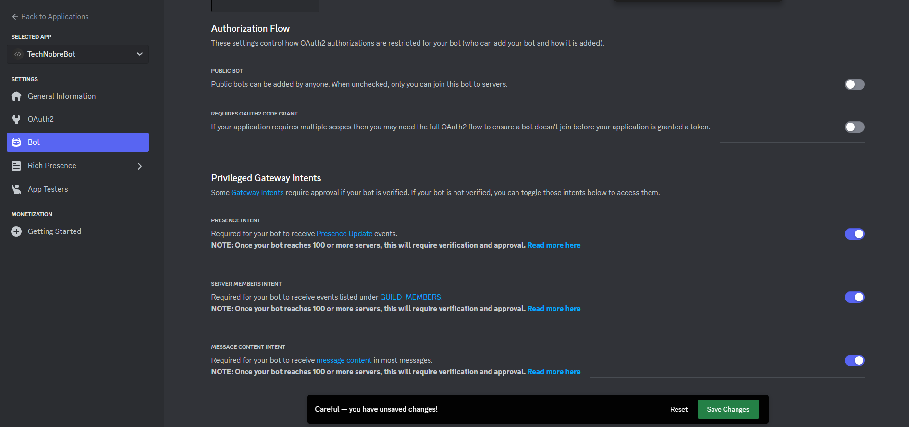
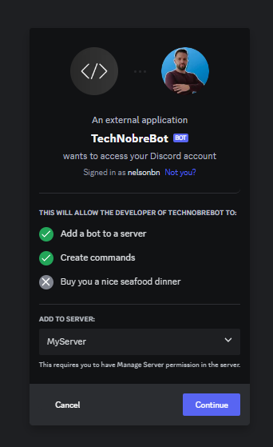

# Create an application in Discord

[<< Back](../README.md)

1. Sign in to your Discord account

2. Go to [Discord Developer Portal](https://discord.com/developers/applications)

   1. Click on `New Application` to create a new application
   2. Enter the name of the application and click on `Create`

3. Enable Bot
   1. Go to the OAuth2 tab and scroll down to the `OAuth2 URL Generator` section and select `bot` in the `scopes` section;
   2. Select the permissions you want to give to the bot and copy the URL generated

    3. This will generate a URL that you can use to invite the bot to your server

4. Get the bot token
    1. Go to the `Bot` tab and click on `Reset` to generate a new token
    2. Click on `Yes, do it!` to confirm
    3. Click on `Copy` to copy the bot token

5. Enable Privileged Gateway Intents
   1. Go to the `Bot` tab and scroll down to the `Privileged Gateway Intents` section
   2. Enable the `PRESENCE INTENT`, `SERVER MEMBERS INTENT` and `MESSAGE CONTENT INTENT` options
   3. Click on `Save Changes` to save the changes

6. Add the bot to your server
   1. Open the URL generated in the previous step
   2. Select the server you want to add the bot to and click on `Continue`
   3. Click on `Authorize` to add the bot to the server

## Update Bot Permissions

   1. Go to the `OAuth2`;
   2. Select `bot` in the `scopes` section;
   3. Select the permissions you want to give to the bot and copy the URL generated

## Permissions

* `Manage Roles`;
* `Manage Channels`;

* `Send Messages`;

* `Manage Messages`;

* `Embed Links`;
* `Attach Files`;
